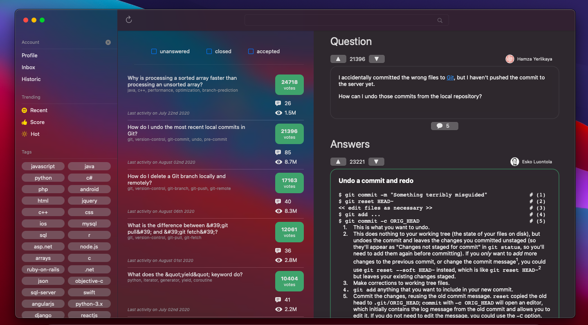

# StackIT



**Summary**

StackIT is a native macOS client app of the StackOverflow website, built in SwiftUI and Combine.

⚠️ Disclaimer n°1 - The app is still in progress, some additional features need to be implemented and some bugs need to be fixed. <br>
⚠️ Disclaimer n°2 - To try the app you need to create a <b>StackConfig.plist</b> in project with your own clientID and key provided by StackOverflow (create an app on stackexchange)

**Description**

The app uses multiple managers to handle business logic within the app and renders it back to the different views using a one and only `ViewManager` @ObservableObject class.

- ViewManager
- AuthenticationManager
- NetworkManager
- KeychainManager
- ImageManager

The `ViewManager` is initialized once and accessible to all the views as an environmment object.<br>
Views will be rendered whenever one the @Published properties inside that `ViewManager` object is mutated.

Every business logic between the `ViewManager` and the other managers are made with `Publisher` and `Subscriber` using Combine. <br>
For example, fetching the initial data (tags and questions) when app launches results in the following implementation:

```
    private func fetchData() {
        let tagsPublisher = fetchTags()
        let questionsPublisher = fetchQuestions(endpoint: .filteredQuestions(tags: [], trending: .votes, page: 1))
        
        Publishers.CombineLatest(tagsPublisher, questionsPublisher)
            .handleEvents(receiveSubscription: { [weak self] _ in
                self?.loadingSections = [.tags, .questions]
            }, receiveOutput: { _ in
                self?.loadingSections = []
            })
            .sink(receiveValue: { [weak self] tags, questions in
                self?.tags = tags
                self?.questionsSummary = questions
            }).store(in: &subscriptions)
    }        
        
```

Views send new values to the `ViewManager` using `PassThroughSubject` and `CurrentValueSubject` variables whenever a new action is required. <br>

_TagSectionView_<br>
`viewManager.fetchQuestionsSubject.send((.tag(tag: tag), false))`

_ViewManager_<br>
`var fetchQuestionsSubject = CurrentValueSubject<SectionOutput, Never>(AppSection.empty)`<br>
```
private func bindFetchQuestions() {
    fetchQuestionsSubject
        .dropFirst()
        .handleEvents(receiveOutput: handleOutputSectionEvent)
        .map(resolveEndpointCall)
        .switchToLatest()
        .handleEvents(receiveOutput: { [weak self] _ in self?.loadingSections = [] })
        .assign(to: \.questionsSummary, on: self)
        .store(in: &subscriptions)
}
```
_NetworkManager_<br>
```
func fetch<T: Decodable>(endpoint: Endpoint, model: T.Type) -> AnyPublisher<T, Error> {
    if let value = cache[endpoint.cacheID] as? T {
        return Just(value)
            .setFailureType(to: Error.self)
            .eraseToAnyPublisher()
    }
        
    guard let url = endpoint.url else {
        return Fail(error: Error.wrongURL).eraseToAnyPublisher()
    }
                
    let decoder = JSONDecoder()
    decoder.keyDecodingStrategy = .convertFromSnakeCase
        
    return URLSession.shared.dataTaskPublisher(for: url)
        .mapError(Error.network)
        .map(\.data)
        .decode(type: model, decoder: decoder)
        .mapError(Error.decodingError)
        .print("#DEBUG GET REQUEST")
        .handleEvents(receiveOutput: { [weak self] model in
            self?.cache[endpoint.cacheID] = model
        })
        .receive(on: RunLoop.main)
        .eraseToAnyPublisher()
}
```

**Dependencies**

- KeychainAccess
