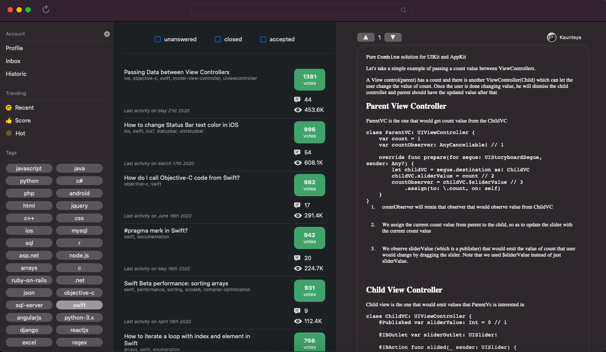

# StackIT

**Summary**

StackIT is a native macOS client app for the StackOverflow website, built in SwiftUI and Combine.

⚠️ Disclaimer n°1 - The app is still in progress, some additional features need to be implemented and some bugs need to be fixed. 
⚠️ Disclaimer n°2 - To try the app you need to create a StackConfig.plist in project with your own clientID and key provided by StackOverflow (create an app on stackexchange)

**Description**

The app uses multiple managers to handle business logic within the app and renders it back to the different views using a one and only `ViewManager` @ObservableObject class.

- ViewManager
- AuthenticationManager
- NetworkManager
- KeychainManager
- ImageManager

The `ViewManager` is initialized once and accessible to all the views as an environmment object. 
Views will be rendered whenever one the @Published properties inside that `ViewManager` object is mutated.

Every business logic between the `ViewManager` and the other managers are made with `Publisher` and `Subscriber` using Combine.
For example, fetching the initial data (tags and questions) when app launches results in the following implementation:

```
    private func fetchData() {
        let tagsPublisher = fetchTags()
        let questionsPublisher = fetchQuestions(endpoint: .filteredQuestions(tags: [], trending: .votes, page: 1))
        
        Publishers.CombineLatest(tagsPublisher, questionsPublisher)
            .handleEvents(receiveSubscription: { _ in
                self.loadingSections = [.tags, .questions]
            }, receiveOutput: { _ in
                self.loadingSections = []
            })
            .sink(receiveValue: { tags, questions in
                self.tags = tags
                self.questionsSummary = questions
            }).store(in: &subscriptions)
    }        
        
```

**Dependencies**

- KeychainAccess

**App screenshot**


