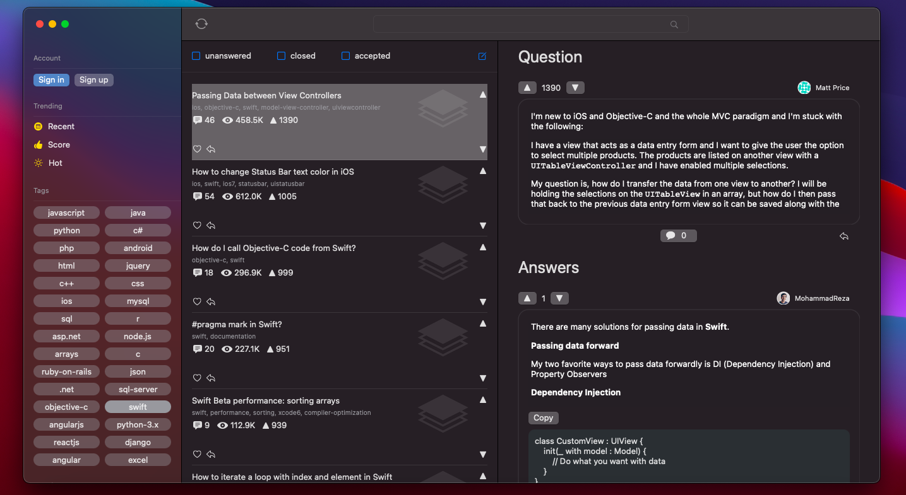

# StackIT

**Summary**

StackIT is a native macOS client app of the StackOverflow website, built in SwiftUI and Combine.

⚠️ To try the app you need to create a <b>StackConfig.plist</b> in project with your own clientID and key provided by StackOverflow (create an app on stackexchange)

**Description**

StackIT enables the user to perform various actions:

- Retrieve questions by popular tags and/or trending categories (recent, hot, scores)
- Search for questions using keywords
- Retrieve answers for a specific question and the comments related to each post.
- Retrieve user data (profile, inbox, timeline) through login
- Add a question / answer / comment ⚠️ WIP
- Upvote or downvote ⚠️ WIP

**Dependencies**

- KeychainAccess
- StackAPI 
- SwiftSoup
